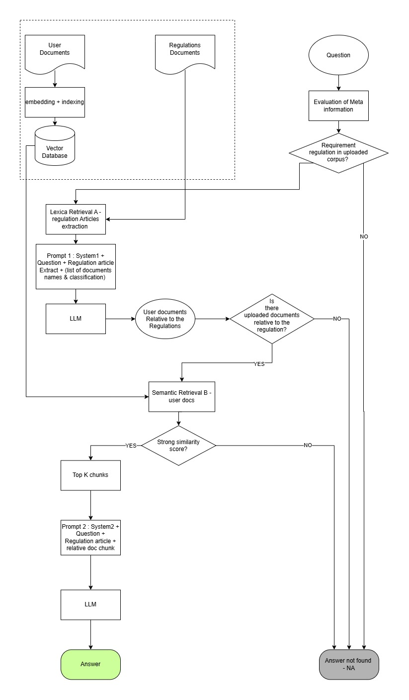

# RAG POC — AI risk & compliance classifier

A FastAPI proof-of-concept that answers a compliance questionnaire about a company's own documents.
Each question in `data/questions.json` cites an article of a regulation (EU AI Act, GDPR, Italian laws
132/2025 and 633/1941). The pipeline fetches that article, asks the model which uploaded PDFs matter,
retrieves the most similar chunks from a vector index, and asks the model for a
`YES / NO / MAYBE / ABSTAIN` answer with a reason.

A question never reaches the model without a regulation article and at least one relevant document
chunk. A full run costs at most **2 chat calls (OpenRouter) + 1 embedding call (Gemini)** per question.



`Pipeline Overview.pdf` walks through the diagram stage by stage and says which file implements each box.

## Requirements

- Python 3.12
- An [OpenRouter](https://openrouter.ai/) API key — chat model
- A [Google AI Studio](https://aistudio.google.com/) API key — Gemini embeddings

## Setup

### 1. Clone the repository

```powershell
git clone https://github.com/zakaria-thami/RAG-POC.git
cd RAG-POC
```

### 2. Create and activate a virtual environment

PowerShell (Windows):

```powershell
python -m venv venv
.\venv\Scripts\Activate.ps1
```

> If PowerShell refuses to run the activation script, allow local scripts once with
> `Set-ExecutionPolicy -Scope CurrentUser RemoteSigned` and try again.

Git Bash / macOS / Linux:

```bash
python -m venv venv
source venv/Scripts/activate   # Git Bash on Windows
source venv/bin/activate       # macOS / Linux
```

### 3. Install the dependencies

```powershell
pip install -r requirements.txt
```

### 4. Configure the API keys

Copy the template and fill in your keys. `.env` is git-ignored and never leaves your machine.

```powershell
Copy-Item .env.example .env
```

| Variable             | Purpose                                                      |
| -------------------- | ------------------------------------------------------------ |
| `OPENROUTER_API_KEY` | Chat model calls (Prompt 1 document router, Prompt 2 answer) |
| `GEMINI_API_KEY`     | Embeddings for the vector index                              |
| `MODEL_NAME`         | OpenRouter model id, e.g. `inception/mercury-2`              |
| `EMBED_MODEL`        | Gemini embedding model (default `gemini-embedding-001`)      |

The tuning knobs (`TOP_K`, `SIMILARITY_CUTOFF`, `CHUNK_SIZE`, `CHUNK_OVERLAP`, `USE_DOC_ROUTER`, …)
are documented in [`rag/config.py`](rag/config.py) and can all be overridden from `.env`.

## Run the server

```powershell
uvicorn main:app --reload
```

- Dashboard: <http://127.0.0.1:8000>
- Interactive API docs (Swagger): <http://127.0.0.1:8000/docs>

`--reload` restarts the server whenever a source file changes; drop it when you are not editing code.

### First run: build the vector index

The vector index (`data/index/`) is not committed, so on a fresh clone the sample PDFs in
`data/Documentations/` have not been embedded yet. Either click **Rebuild index** in the dashboard's
*Overview* tab, or call the endpoint directly:

```powershell
Invoke-RestMethod -Method Post http://127.0.0.1:8000/api/index/rebuild
```

This costs one Gemini embedding request per batch of chunks. Uploading a document through the
dashboard embeds it immediately, so a full rebuild is only needed after changing `CHUNK_SIZE` /
`EMBED_MODEL` or deleting `data/index/`.

## Watch the chat log

Every prompt, answer, model name, latency and token count is appended to `data/chat.log`.
Keep it open in a second terminal while you test:

PowerShell:

```powershell
Get-Content data\chat.log -Wait -Tail 20 -Encoding UTF8
```

Git Bash:

```bash
tail -f data/chat.log
```

## Dashboard tabs

| Tab                                 | What it does                                                                                                 |
| ----------------------------------- | ------------------------------------------------------------------------------------------------------------ |
| Overview                            | Index status and **Rebuild index**                                                                           |
| Upload document / Document list     | Add company PDFs with a type (DPIA, technical documentation, …); each file is chunked and embedded on upload |
| Upload regulation / Regulation list | Add regulation texts as Markdown, one `## Articolo N` / `## Art. N` / `## ALLEGATO I` heading per article    |
| Questionnaire                       | Answer one question or **Answer all**; results are saved to `data/answers.json`                              |
| Chat                                | Send a free-text question straight to the model with no retrieval — the phase-1 baseline to compare against  |

## API

Every endpoint lives under `/api` and exposes one stage of the pipeline, so each step can be tested on its own.

| Method | Path                                                       | Stage                                                                                     |
| ------ | ---------------------------------------------------------- | ----------------------------------------------------------------------------------------- |
| GET    | `/api/documentations`, POST `/api/upload`                  | Documents                                                                                 |
| GET    | `/api/regulations`, POST `/api/upload-regulation`          | Regulations                                                                               |
| GET    | `/api/questions`, `/api/questions/{id}/context`            | Questionnaire and the article each question cites                                         |
| GET    | `/api/regulations/{target}/articles/{article_id}`          | Lexical retrieval A: pull one article out of a regulation                                 |
| GET    | `/api/index/status`, POST `/api/index/rebuild`             | Vector index                                                                              |
| GET    | `/api/search?q=…&docs=a.pdf,b.pdf&top_k=5&cutoff=0.6`      | Semantic retrieval B with raw similarity scores (use it to calibrate `SIMILARITY_CUTOFF`) |
| POST   | `/api/route/{id}`                                          | Prompt 1: which documents matter for this question                                        |
| POST   | `/api/answer/{id}`, `/api/answer-all`, GET `/api/answers`  | Prompt 2: final answer                                                                    |
| POST   | `/api/chat`                                                | No-retrieval baseline                                                                     |

## How a question can end

- **NA** — regulation file missing, or the cited article is not found in it (no model call)
- **NA** — no documents uploaded, or Prompt 1 selects none (1 call)
- **NA** — no chunk above `SIMILARITY_CUTOFF` (1 call + 1 embedding)
- **Answered** — `YES / NO / MAYBE / ABSTAIN` with a reason (2 calls + 1 embedding)

## Project layout

```
main.py                        FastAPI app, serves the dashboard
api/                           one router per feature: documentation, regulations, rag, llm
rag/
  config.py                    every tunable, read from .env
  pipeline.py                  answer_question() / answer_all() orchestration
  indexing.py                  PDF -> chunks -> Gemini embeddings -> persisted index
  retrieval.py                 semantic retrieval + similarity cutoff
  regulations.py               article extraction from the regulation .md files
  questions.py                 loads data/questions.json
  prompts.py                   SYSTEM_ROUTER (Prompt 1) and SYSTEM_ANSWER (Prompt 2)
  llm.py                       OpenRouter client, JSON reply parsing, chat.log writer
classification/                placeholder package, not wired in yet
scripts/check_questions.py     sanity check: every article cited in questions.json resolves to a heading
data/
  Documentations/              sample company PDFs (synthetic, see below)
  Regulations/                 AI Act, GDPR, L. 132/2025, L. 633/1941 as Markdown
  questions.json               the questionnaire
  documentation.json           registry of uploaded documents (filename, type, preview)
  regulations.json             registry of uploaded regulations
  index/                       vector index — git-ignored, rebuilt
  chat.log                     transcript — git-ignored
  answers.json                 last "Answer all" run — git-ignored
templates/, static/            dashboard HTML and CSS
```

## Sample data

The PDFs in `data/Documentations/` describe a fictional company ("Acme Talent S.r.l.") and its AI
hiring tool *TalentMatch*; they exist only to exercise the pipeline. That folder is the upload target
and is git-ignored apart from these samples, so documents you upload yourself are never committed by
accident. The regulation texts in `data/Regulations/` are public legal texts.
